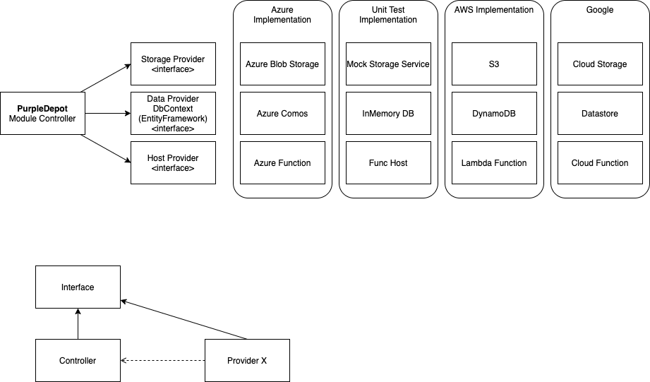

# General Architecture

## Registry Notes

- Module downloads use Terraform's `204` + `X-Terraform-Get` redirect pattern.
- Provider installs use the Terraform provider registry package endpoints:
  - `GET v1/providers/{namespace}/{name}/{version}/download/{os}/{arch}`
  - `GET v1/providers/{namespace}/{name}/{version}/download/{os}/{arch}/SHA256SUMS`
  - `GET v1/providers/{namespace}/{name}/{version}/download/{os}/{arch}/SHA256SUMS.sig`
- Provider package uploads must target:
  - `POST v1/providers/{namespace}/{name}/{version}/upload/{os}/{arch}`
  - with `X-Terraform-Protocols: 5.0,6.0`

## Configuration

The Azure Functions host expects the `PurpleDepot` configuration section. Provider signing also requires:

- `PurpleDepot:ProviderSigning:PrivateKey`
- `PurpleDepot:ProviderSigning:Passphrase` (optional)

When running in development with `MockStorageService<T>`, download URLs are proxied back through the host at `v1/archive/{fileKey}` so Terraform can fetch mock-backed module and provider packages end to end.
